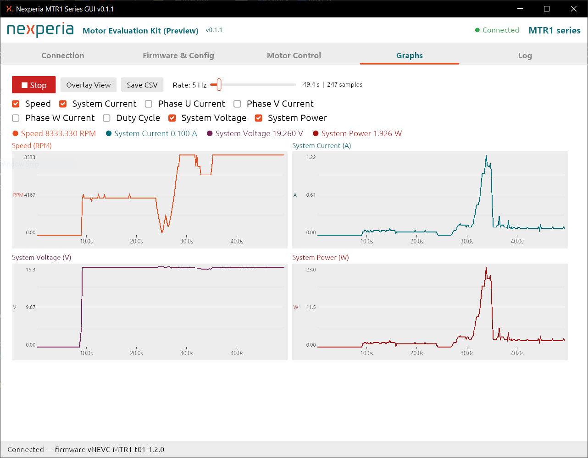
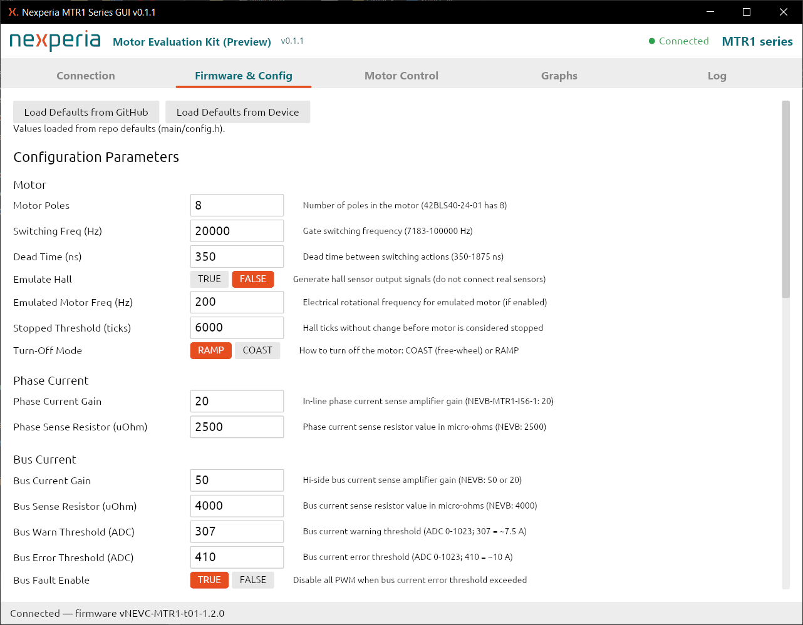

<picture align="center">
  <source media="(prefers-color-scheme: dark)" srcset="https://raw.githubusercontent.com/Nexperia/NEVC-MTR1-GUI/refs/heads/main/assets/logo/nexperia_logo_dark.svg">
  
</picture>

-----------------
# NEVC-MTR1-GUI: GUI for the NEVB-MTR1-KIT1 BLDC motor driver kit

[](https://github.com/Nexperia/NEVB-MTR1-t01/blob/main/LICENSE)

Windows GUI for controlling the Nexperia NEVC-MTR1 motor driver board via SCPI over USB-serial.

The GUI connects to an Arduino Leonardo running the
[NEVC-MTR1-t01 firmware](https://github.com/Nexperia/NEVC-MTR1-t01) and provides:

- Live motor control (enable/disable, frequency, direction)
- Real-time measurement graphs (speed, currents, duty cycle, voltage)
- Firmware configuration editor - all 26 parameters in `config.h`
- One-click compile and upload (arduino-cli and the Arduino AVR core are
  downloaded automatically on first use)

The kit hardware is documented on the
[Nexperia NEVB-MTR1-KIT1 product page](https://www.nexperia.com/applications/evaluation-boards/NEVB-MCTRL-100---1-kW--12-48-V-BLDC-motor-driver-kit).

## Screenshots

| Graphs | Firmware & Config |
|--------|------------------|
|  |  |

---

## Using a pre-built release

1. Download the latest `NEVC-MTR1-GUI.exe` from the [Releases](../../releases) page.
2. Connect the Arduino Leonardo USB cable to your PC.
3. Run `NEVC-MTR1-GUI.exe` - no installation required.
4. Select the COM port in the **Connection** tab and click **Connect**.

On first launch the app downloads `arduino-cli.exe` and the Arduino AVR core
(~130 MB, one time only). These are stored in
`%APPDATA%\nevc_mtr1_gui\tools\` and reused on subsequent runs.

---

## Building from source

### Prerequisites

| Tool | Version |
|------|---------|
| Rust (stable toolchain) | 1.77 or newer |
| Windows | 10 / 11 (64-bit) |

Install Rust via [rustup.rs](https://rustup.rs/).

### Build

```powershell
# Development build (faster compilation)
cargo run

# Optimised release build
cargo build --release
# Output: target\release\NEVC-MTR1-GUI.exe
```

### Project layout

```
src/
  main.rs          - entry point
  app.rs           - top-level iced application state and message routing
  serial/          - serial port detection and async I/O
  scpi/            - SCPI command builder and response parser
  firmware/        - FirmwareConfig model, arduino-cli bootstrap, compile/upload
  ui/              - per-tab panel widgets (connection, motor, graphs, firmware, config, log)
assets/
  fonts/           - embedded fonts
  icon/            - application icon (.ico, .png)
```

---

## Firmware

The GUI targets the **`main`** branch of
[github.com/Nexperia/NEVC-MTR1-t01](https://github.com/Nexperia/NEVC-MTR1-t01).

The firmware implements trapezoidal (six-step) commutation of a BLDC motor
using Hall-effect sensors on the Arduino Leonardo / ATmega32U4 platform.
All motor parameters are user-configurable via `main/config.h`; the GUI
exposes every parameter and can compile and flash a custom build without
leaving the application.

Pre-built firmware can also be uploaded manually using the Arduino IDE or
`arduino-cli`. Refer to the
[firmware repository README](https://github.com/Nexperia/NEVC-MTR1-t01#readme)
and the
[NEVB-MTR1-KIT1 user manual (UM90029)](https://assets.nexperia.com/documents/user-manual/UM90029.pdf)
for hardware setup and pin-out details.

---

## License

MIT/X Consortium License — see [LICENSE](LICENSE).
